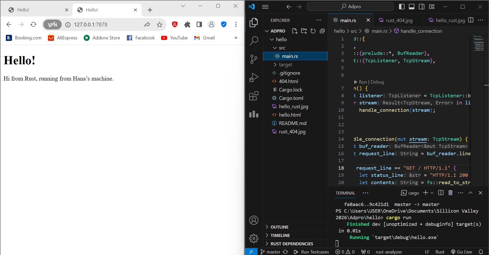

## Commit 1 Reflection Notes
handle_connection method yang terdapat pada rust berfungsi membaca HTTP request dan me-return output berupa keterangan dan informasi HTTP request tersebut. Method ini menggunakan 
```TcpStream``` dan ```BufReader``` untuk melakukan pembacaan yang efisien. Pada akhir kode, terdapat line ```println!("Request: {:#?}", http_request);``` yang akan mengembalikan output
http_request 

## Commit 2 Reflection Notes

Perubahan yang kita lakukan pada ```handle_function``` memungkinkan web server terkait dapat membuka file html yang bersesuaian dengan kode pada ```hello.html```. Pada modifikasi yang dilakukan pada file ```main.rs```, penambahan modul ```fs``` memungkinkan Rust untuk berinteraksi dengan file lain, dalam hal ini file html. Selain itu pada akhir kode, terdapat line ```stream.write_all(response.as_bytes()).unwrap();``` yang berfungsi mengirim kembali respons ke dalam urutan byte

## Commit 3 Reflection Notes

Pertama, saya menambahkan file baru ```404.html``` sesuai dengan contoh yang diberikan pada modul. Setelah itu, saya melakukan modifikasi pada file ```main.rs``` dengan menambahkan kondisi pada request_line. Jika request berhasil ditemukan yang ditandai dengan "HTTP/1.1 200 OK", maka akan ditampilkan laman dari ```hello.html```. Sementara itu, jika status line tidak ditemukan atau menghasilkan "HTTP/1.1 404 NOT FOUND", maka laman dari file ```404.html``` akan ditampilkan

## Commit 4 Reflection Notes
Simulasi slow request menunjukkan tentang bagaimana perubahan kode yang dilakukan berpengaruh terhadap response dari html ketika perintah cargo run dijalankan. Dengan menambahkan baris kode 
```
let (status_line, filename) = match &request_line[..] {
        "GET / HTTP/1.1" => ("HTTP/1.1 200 OK", "hello.html"),
        "GET /sleep HTTP/1.1" => {
            thread::sleep(Duration::from_secs(10));
            ("HTTP/1.1 200 OK", "hello.html")
        }
        _ => ("HTTP/1.1 404 NOT FOUND", "404.html"),
    };
```
dimana didalamnya terdapat implementasi modul thread dan time::Duration, ketika kita memasukkan input ```http://127.0.0.1:7878/sleep```, kita diharuskan untuk menunggu lebih lama sebelum akhirnya file html akan dimunculkan. Hal ini tentunya berbeda dengan ketika kita memberikan input ```http://127.0.0.1:7878``` dimana file html dapat langsung ditampilkan. Proses delay ini terjadi karena perintah ```http://127.0.0.1:7878/sleep``` akan menjalankan kode ```thread::sleep(Duration::from_secs(10));``` yang menyebabkan kita harus menunggu sekitar 10 detik sebelum akhirnya file html dimunculkan pada web browser

## Commit 5 Reflection Notes
Threadpool adalah kumpulan thread yang berfungsi untuk mengeksekusi fungsi secara paralel. Pada kode rust yang kita punya, threadpool berfungsi untuk menciptakan suatu multithreaded server. Threadpool bekerja dengan menerapkan sejumlah thread workers yang kemudian akan melakukan isi ulang kembali jika terdapat worker threads panic. Pada modifikasi yang dilakukan, implementasi threadpool ditandai dengan kode ```let pool = ThreadPool::new(4);``` yang menandakan dibuatnya variabel pool sebagai instance dari threadpool yang terdiri atas 4 thread. Penggunaan threadpool ini bertujuan agar kode yang ada dapat memiliki efisiensi yang lebih baik